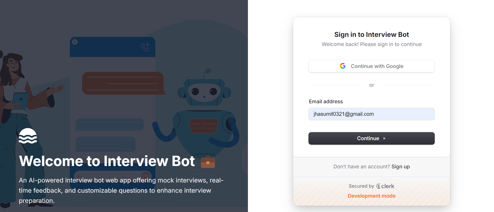
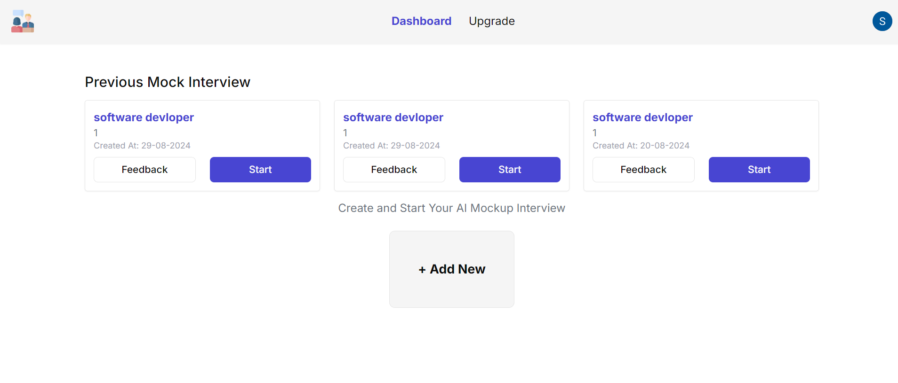
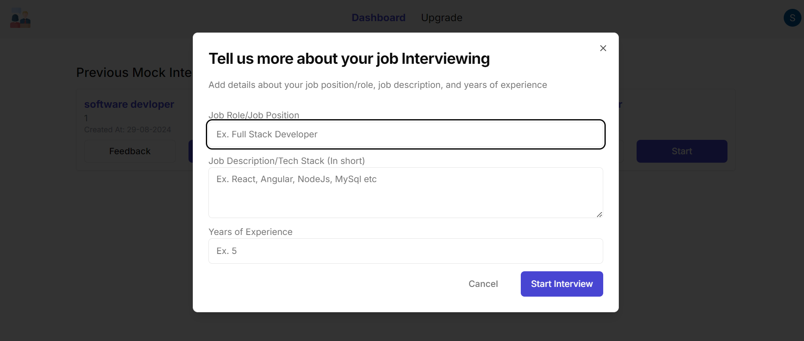
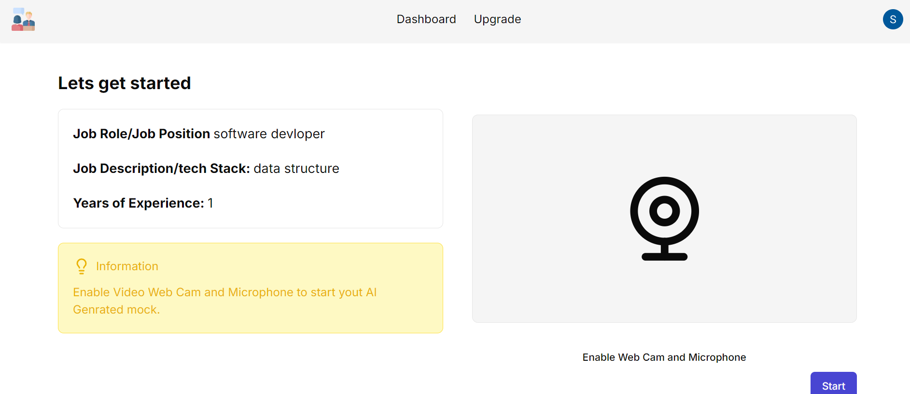
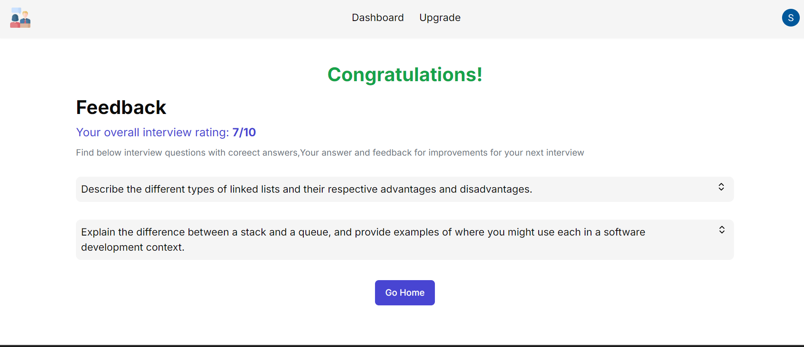

Interview Bot Web App
Overview
Welcome to the Interview Bot Web App! This application is designed to provide a platform for conducting mock interviews, helping users to prepare effectively for real job interviews. Whether you're gearing up for a technical interview or refining your soft skills, this bot has you covered.

Features
Mock Interviews: Conduct interviews with a range of predefined questions.
Real-time Feedback: Get instant feedback on your performance.
User Authentication: Securely sign in and track your progress over time.
Customizable Question Bank: Tailor the interview questions to match your job profile.
Tech Stack
Frontend: React, Next.js
Backend: Node.js, Express.js
Database: Drizzle ORM
Authentication: Clerk
APIs: Integrated with the Gemini API for advanced features
Experience
With a strong background in MERN stack development, I have leveraged my expertise to create this full-fledged web application. My experience with React and Next.js ensures a smooth, responsive user experience, while my backend skills in Node.js and Express.js power the application's core functionalities. The database interactions are managed efficiently using Drizzle ORM, and Clerk handles user authentication seamlessly.

Installation
To run this application on your local desktop, follow these steps:

Clone the Repository:

bash
Copy code
git clone
cd interview-bot-web-app
Environment Variables: Ensure you have the following environment variables set up in your .env file:

bash
Copy code
NEXT_PUBLIC_GEMINI_API_KEY=<your-gemini-api-key>
NEXT_PUBLIC_DRIZZLE_DB_URL=<your-drizzle-db-url>
NEXT_PUBLIC_CLERK_PUBLISHABLE_KEY=<your-clerk-publishable-key>
CLERK_SECRET_KEY=<your-clerk-secret-key>
NEXT_PUBLIC_CLERK_SIGN_IN_URL=<your-clerk-sign-in-url>
NEXT_PUBLIC_CLERK_SIGN_UP_URL=<your-clerk-sign-up-url>
Install Dependencies: Run the following command to install all necessary packages:

bash
Copy code
npm install
Run the Application: Start the development server with:

bash
Copy code
npm run dev
Access the Application: Open your browser and go to http://localhost:3000 to access the app.

Contributing
Contributions are welcome! Feel free to submit a pull request or report any issues you encounter.

Contact
For any inquiries or feedback, you can reach out to me at jhasumit0321@gmail.com.

